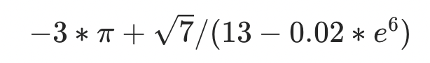
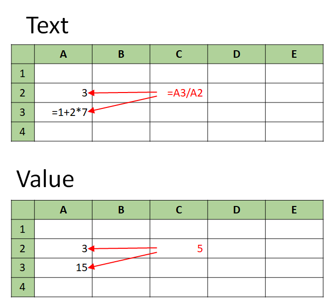
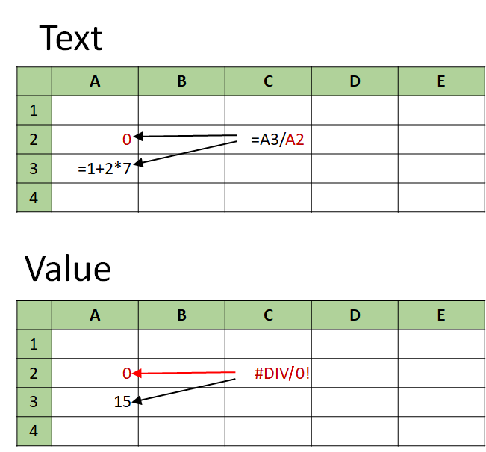
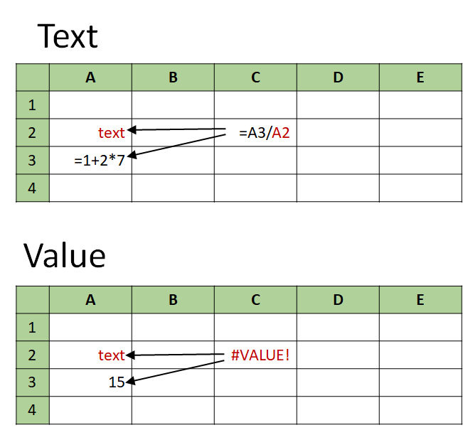
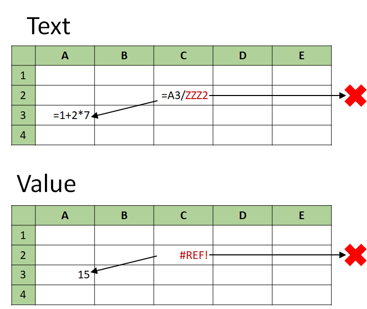
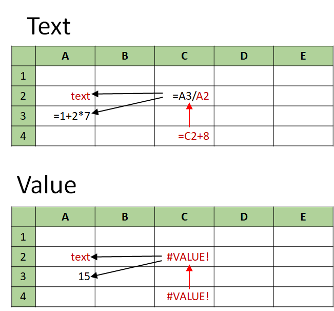
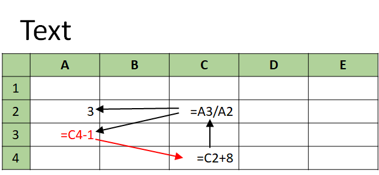
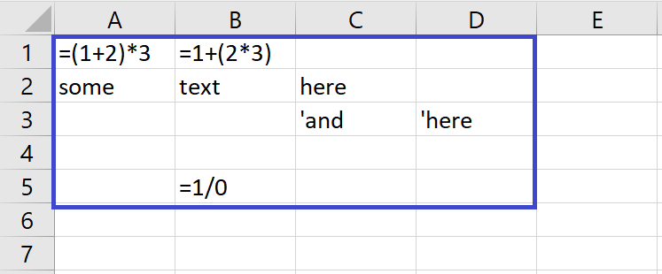
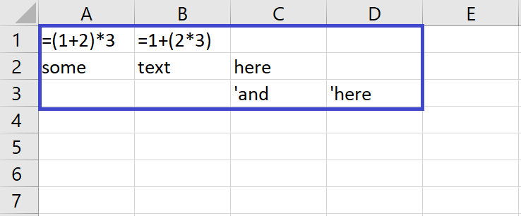
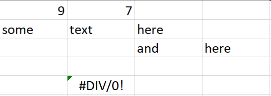

# Spreadsheet
## Проект "Электронная таблица"

Упрощённый аналог существующих решений: лист таблицы Microsoft Excel или Google Sheets. В ячейках таблицы могут быть текст или формулы. Формулы, как и в существующих решениях, могут содержать индексы ячеек.

### Разделы

- Компьютерное представление формул
    - Состав формулы
    - Вычисление и приоритет операций
    - Машинное представление формулы
    - Вычисление формулы
    - Как компьютер вычисляет формулы
    - Этапы вычисления
    - Парсинг формулы и дерево разбора
    - Дерево для вычисления формулы
- ANTLR
- Дерево для вычисления формул
- Ячейки
    - Типы ячеек
    - Представление ячеек
    - Формульная ячейка
    - Текстовая ячейка
    - Вычисление значений в ячейках
    - Ошибки вычисления
    - Циклические зависимости
    - Если в ячейке поменяли текст
- Кэш
- Возможные ошибки и исключения
- Таблица
    - Минимальная печатная область
    - Методы, применимые к таблице целиком
    - Требования к эффективности
- Сборка и установка
    - Установка ANTLR
- Планы по расширению функционала
 
### Компьютерное представление формул

В нескольких примерах разберёмся с представлением формул, заданными текстом. Мы посмотрим на формулы с точки зрения компьютера и поймём, в каком виде компьютеры их хранят и как вычисляют.

Возьмём привычную математическую формулу и попробуем её вычислить:

Проанализируем, как вычисляет значение формулы человек.

#### Состав формулы

В формулу входят три компоненты:
- Операнды — объекты, над которыми совершаются операции: числа, константы и переменные.
- Операции — действия над операндами, в результате которых получается новый операнд. 
    - Унарные операции совершаются над одним объектом: извлечение корня, изменение знака, взятие натурального логарифма;
    - Бинарные операции требуют двух объектов: сложение, вычитание, умножение, деление, возведение в степень.
- Скобки — специальные знаки, задающие порядок выполнения операций.

#### Вычисление и приоритет операций

Вычисляя значение нашей формулы, будем выполнять операции по очереди:
- умножим −3 на π
- извлечём квадратный корень из 7: 
- посчитаем экспоненту от 6: 
- умножим полученный результат на 0.02: 
- вычтем полученное число из 13: 
- поделим результат второй операции на результат пятой операции: 
- наконец, сложим результат первой операции с результатом шестой операции: 

Мы выполнили операции не в том порядке, в котором они записаны слева направо. Ведь из школьной арифметики знаем, что:
- операции внутри скобок выполняются перед операциями вне скобок;
- умножение выполняется перед сложением, а возведение в степень — перед умножением.

Правила, по которым мы определяем, в каком порядке выполнять операции, называются приоритеты операций.

#### Машинное представление формулы

Когда мы вычисляли формулу, на каждом шаге брали один или два операнда, проводили над ними операции и получали новый операнд. Этот результат будет операндом для следующей операции.

Для этой последовательности действий очень подходит структура данных дерево. В компьютерах формулы представляются именно в виде деревьев.

**Дерево** — это связный граф без циклов. У каждого узла, кроме одного, есть один узел-родитель и несколько узлов-потомков. В нашем случае не больше двух: правый и левый.
- Узлы без потомков называются листья.
- Узлы, у которых есть потомки, называются внутренние вершины.
- Узел, у которого нет родителей, называется корень.

Корень задаёт всё дерево, потому что из корня можно обойти все узлы.
В нашем дереве во внутренних узлах находятся операции, а в листьях — операнды. 
- Во внутренних узлах находятся операции. Узел также содержит один или два указателя на узлы-потомки. В потомках находятся выражения, которые надо будет подставить в операцию для получения результата. Для некоммутирующих операций важен порядок операндов. Поэтому узел хранит указатели на потомков в определённом порядке: левый и правый потомок. Например, результат сложения никак не изменится, если поменять местами левый и правый потомок (1+2 = 2+1). А вот с вычитанием это уже нельзя сделать (1-2≠2-1). Поэтому при парсинге мы будем делать так: выражение, стоящее слева от операции, — это левый потомок, выражение справа — правый.
- В листьях дерева находятся операнды. Они не имеют потомков.

#### Вычисление формулы

Дерево используют, потому что по нему удобно рекурсивно вычислять значение формулы. Чтобы получить результат операции во внутреннем узле, нужно:
- вычислить результаты в его дочерних узлах,
- применить к ним операцию, находящуюся в узле.

Значения листовых узлов уже известны — это сами операнды.

Чтобы реализовать дерево, надо реализовать его узлы. Узел должен содержать:
- собственно операцию или операнд;
- указатели на свои дочерние узлы;
- метод вычисления операции *GetValue()*.

Чтобы вычислить значение всей формулы, надо вызвать метод Evaluate для корня.

#### Как компьютер вычисляет формулы

Для того, чтобы научить программу вычислять формулу, понадобится создать пригодное для вычислений дерево. Используем абстрактное синтаксическое дерево, или AST.
Абстрактное синтаксическое дерево не умеет ничего вычислять, нужно добавить в него соответствующий функционал.

#### Этапы вычисления

Мы помним, что формула состоит из операндов и операций**. Чтобы вычислить её, нужно знать:
- Какие бывают операции и операнды:
    - операции могут быть арифметическими (+, -, *, /), логическими (&, |, ⇒, ~);
    - операнды могут быть числами (1, 5, 1000.01), булевыми переменными (**TRUE**, **FALSE**) или константами;
- Каков приоритет у операций.
- Что означают конкретные операции — то есть что нужно сделать с операндами, чтобы совершить операцию. Из школьной арифметики помним, что такое сложение и вычитание. Но по умолчанию программа не знает, что имеется в виду именно школьное сложение. Это надо прямо определить. То же самое для других операций, особенно не совсем очевидных: штрих Шеффера или стрелка Пирса в булевой алгебре.

#### Парсинг формулы и дерево разбора

Правила, определяющие вид операций и операндов, а также приоритет операций  называются **грамматикой языка**. Зная их, мы можем представить формулу в виде дерева. Это происходит в два этапа:
- **Лексические правила** определяют вид операций и операндов. По ним лексический анализатор разобьёт исходную строчку-формулу на составные части — токены. Например, строку "1+2\*3" он разобьёт на: число (1), сложение (+), число (2), умножение (*), число (3).
- **Синтаксические правила** задают приоритет операций. Синтаксический анализатор группирует токены в так называемое дерево разбора в соответствии с приоритетом. Операнды располагаются в листьях, операции — во внутренних узлах. В примере выше умножение 2*3 имеет более высокий приоритет, чем сложение 1+6, поэтому сложение выполнится после умножения и попадёт в узел дерева.

#### Дерево для вычисления формулы

Дерево разбора заточено под обработку текста, но не под вычисление формул. Для дерева разбора операции — это лишь символы, не несущие вычислительного смысла. Дерево разбора не умеет совершать операции, оно только может отличить операцию от операнда. Мы не можем использовать его для вычисления формул.

Для дерева разбора существуют алгоритмы обхода. Обычная практика — рекурсивно преобразовывать дерево разбора в **абстрактное синтаксическое дерево** (**abstract syntax tree, AST**).

Для абстрактного синтаксического дерева определяются классы-узлы с методом для вычисления - *GetValue()*.

Для разбивки строки на токены и составления дерева разбора существует готовое решение — **ANTLR**.

### ANTLR

**ANTLR** — это специальная программа, которая генерирует код лексического и синтаксического анализаторов, а также код для обхода дерева разбора на С++.

В **ANTLR** пользователь задаёт грамматику — правила, по которым:
- сначала формула разбивается на компоненты-токены;
- затем токены группируются в дерево разбора.

Файл с грамматикой имеет расширение \*.g4. В нашем случае формула может состоять из чисел, скобок и четырёх арифметический операций: сложения, вычитания, умножения и деления. *Formula.g4*.

Лексические правила в этой грамматике записаны заглавными буквами: **NUMBER**, **CELL**, **ADD**, **SUB**, **MUL**, **DIV**. Они определяют, как могут выглядеть операции и операнды, то есть на какие токены должна быть разбита строка с формулой.

Синтаксические правила определяют, как может выглядеть выражение expr — **будущий узел дерева разбора. Рассмотрим основное правило: 

    expr
        : '(' expr ')'  # Parens
        | (ADD | SUB) expr  # UnaryOp
        | expr (MUL | DIV) expr  # BinaryOp
        | expr (ADD | SUB) expr  # BinaryOp
        | CELL  # Cell
        | NUMBER  # Literal
        ;

Оно означает, что выражение может быть:
* выражением внутри скобок;
* отрицательным значением другого выражения;
* произведением или частным двух других выражений;
* суммой или разностью двух других выражений;
* ячейкой;
* числом.

Вариант выше по списку имеет больший приоритет. Например, в формуле 123 + 456 * 789 сначала будет выполнено умножение, а затем сложение.

Чтобы **ANTLR** сгенерировал исполняемые файлы на С++, нужно выполнить команду:

    antlr4 -Dlanguage=Cpp Formula.g4

Рассмотрим подробнее, что сгенерировал ANTLR:
- *Formula.interp*, *Formula.tokens* — вспомогательные текстовые файлы;
- *FormulaLexer.{cpp,h}* — код лексического анализатора;
- *FormulaParser.{cpp,h}* — код синтаксического анализатора;
- *FormulaListener.{cpp,h}*, *FormulaBaseListener.{cpp,h}* — код listener'а, разновидности паттерна visitor для дерева разбора. Он позволяет обходить дерево разбора и строить наше абстрактное синтаксическое дерево для вычисления формул.

Эти файлы будут работать в основном проекте. Используя результат их работы можно строить абстрактное синтаксическое дерево, которое умеет вычислять формулы.

Подробнее об установке и сборке **ANTLR** в разделе **Сборка и использование**.

### Дерево для вычисления формул

Лексический анализ и синтаксический анализ — то есть составление дерева разбора — для нас сделает **ANTLR**.

Абстрактное синтаксическое дерево вычисляет значения в узлах - класс *FormulaAST*.
Класс [*FormulaAST*](https://github.com/konstantinbelousovEC/cpp-spreadsheet/blob/f871cf7213900bba93ff7dbe301b240d0d800675/spreadsheet/FormulaAST.h#L18) реализован в файлах *FormulaAST.h* и *FormulaAST.cpp*.

Класс представляет собой дерево. Узлы реализованы классом [*Expr*](https://github.com/konstantinbelousovEC/cpp-spreadsheet/blob/f871cf7213900bba93ff7dbe301b240d0d800675/spreadsheet/FormulaAST.cpp#L43). Само дерево задаётся указателем на его корень *root_expr_*.
Узлы дерева могут содержать бинарные и унарные операции либо числа. Для них реализованы три дочерних класса для класса *Expr*:  [*BinaryOpExpr*](https://github.com/konstantinbelousovEC/cpp-spreadsheet/blob/f871cf7213900bba93ff7dbe301b240d0d800675/spreadsheet/FormulaAST.cpp#L70), [*UnaryOpExpr*](https://github.com/konstantinbelousovEC/cpp-spreadsheet/blob/f871cf7213900bba93ff7dbe301b240d0d800675/spreadsheet/FormulaAST.cpp#L148), [*CellExpr*](https://github.com/konstantinbelousovEC/cpp-spreadsheet/blob/f871cf7213900bba93ff7dbe301b240d0d800675/spreadsheet/FormulaAST.cpp#L189) и [*NumberExpr*](https://github.com/konstantinbelousovEC/cpp-spreadsheet/blob/f871cf7213900bba93ff7dbe301b240d0d800675/spreadsheet/FormulaAST.cpp#L219). Узел содержит информацию о себе — вид операции, значение числа — и указатели на своих потомков. Также он содержит метод *Evaluate()*, который вычисляет значение выражения в узле. Объявление и реализация *Expr* находится в файле *FormulaAST.cpp*. 

Свободная функция [*ParseFormulaAST(std::istream&)*]https://github.com/konstantinbelousovEC/cpp-spreadsheet/blob/f871cf7213900bba93ff7dbe301b240d0d800675/spreadsheet/FormulaAST.cpp#L348) создаёт дерево из текста формулы. Она поочерёдно вызывает лексический и синтаксический анализаторы, а затем рекурсивно обходит дерево разбора и строит заготовку дерева для вычислений.

[*Formula*](https://github.com/konstantinbelousovEC/cpp-spreadsheet/blob/f871cf7213900bba93ff7dbe301b240d0d800675/spreadsheet/formula.cpp#L16) - класс-обёртка над *FormulaAST*.

Этот класс обрабатывает ошибки в формулах и необходим для электронной таблицы. С ним таблица будет работать устойчиво, даже если пользователь введёт синтаксически неверную формулу либо формулу, содержащую деление на 0.
Пользуясь существующими решениями, вы, наверно, замечали, что если ввести в ячейку синтаксически некорректную формулу типа “1+-20*”, программа не позволит создать такую ячейку и выведет сообщение об ошибке.
С другой стороны, можно создать синтаксически корректную формулу, которую невозможно вычислить (например “=1/(2-2)”). Программа создаст ячейку, но в качестве значения выведет *#DIV/0!*.

В первом случае формулу не получилось создать, то есть распарсить, во втором — вычислить. 
Поэтому в файле common.h созданы два типа исключений:
- Ошибка вычисления формулы [*FormulaError*](https://github.com/konstantinbelousovEC/cpp-spreadsheet/blob/f871cf7213900bba93ff7dbe301b240d0d800675/spreadsheet/common.h#L47)
- Ошибка создания формулы [*FormulaException*](https://github.com/konstantinbelousovEC/cpp-spreadsheet/blob/f871cf7213900bba93ff7dbe301b240d0d800675/spreadsheet/common.h#L72)

Для таблицы ошибка вычисления не должна быть проблемой. Но программа должна информировать пользователя, что формулу не удалось посчитать, и по возможности указывать причину: например деление на 0.

Объект класса *Formula* создаётся в функции [*std::unique_ptr<FormulaInterface> ParseFormula(std::string expression)*](https://github.com/konstantinbelousovEC/cpp-spreadsheet/blob/f871cf7213900bba93ff7dbe301b240d0d800675/spreadsheet/formula.cpp#L78). Если строка expression содержит синтаксически некорректную формулу, метод кидает исключение *FormulaException*.

Метод [*FormulaInterface::Value Evaluate(const SheetInterface& sheet)*](https://github.com/konstantinbelousovEC/cpp-spreadsheet/blob/f871cf7213900bba93ff7dbe301b240d0d800675/spreadsheet/formula.cpp#L38) вычисляет значение формулы и возвращает число, если формулу удалось вычислить. Если не удалось, возвращает ошибку вычисления *FormulaError*. Для этого в файле *common.h* объявлен метод вывода ошибки в поток, а в файле *formula.cpp* он реализован.

В методе вывода формулы в поток [*GetExpression()*](https://github.com/konstantinbelousovEC/cpp-spreadsheet/blob/f871cf7213900bba93ff7dbe301b240d0d800675/spreadsheet/formula.cpp#L67) используется «очищенная» формула без лишних скобок из [*FormulaAST::PrintFormula(std::ostream& out)*](https://github.com/konstantinbelousovEC/cpp-spreadsheet/blob/f871cf7213900bba93ff7dbe301b240d0d800675/spreadsheet/FormulaAST.cpp#L399).

### Ячейки

Лист электронной таблицы содержит ячейки с данными - класс [*Cell*](https://github.com/konstantinbelousovEC/cpp-spreadsheet/blob/f871cf7213900bba93ff7dbe301b240d0d800675/spreadsheet/cell.h#L11).

В существующих решениях пользователь задаёт ячейке некий текст. В зависимости от содержания программа определяет его по-разному, например: как обычный текст, формулу, дату, валюту. С ячейками разных типов можно совершать разные операции.
Целью является реализация похожего, но упрощённого функционала. Ограничимся двумя типами ячеек: простой текст *std::string* и числа с плавающей точкой *double*. Причём последние могут появиться только как результат вычисления формул.

Интерфейс класса [*CellInterface*](https://github.com/konstantinbelousovEC/cpp-spreadsheet/blob/f871cf7213900bba93ff7dbe301b240d0d800675/spreadsheet/common.h#L82) расположен в файле common.h.

#### Типы ячеек

В проекте ячейки могут трактоваться как текстовые и формульные. Тип зависит от текста, который пользователь задал в методе [*Cell::Set()*](https://github.com/konstantinbelousovEC/cpp-spreadsheet/blob/f871cf7213900bba93ff7dbe301b240d0d800675/spreadsheet/cell.cpp#L52). 
- Ячейка формульная, если её текст начинается со знака "=". То, что следует после знака "=", называется выражением формулы.
- Все остальные ячейки трактуются как текстовые.

Тип существующей ячейки может меняться, если пользователь задал в ячейке новый текст методом *Set()*: формульная ячейка может стать текстовой и наоборот.

Когда пользователь задаёт текст формульной ячейки в методе *Cell::Set()*, лексический анализатор возвращает [*std::forward_list<Position> cells_*](https://github.com/konstantinbelousovEC/cpp-spreadsheet/blob/f871cf7213900bba93ff7dbe301b240d0d800675/spreadsheet/FormulaAST.h#L35) с индексами ячеек, входящих в формулу.

Ячейки определяются тремя типами насследников класса [*CellImpl*](https://github.com/konstantinbelousovEC/cpp-spreadsheet/blob/f871cf7213900bba93ff7dbe301b240d0d800675/spreadsheet/cell.cpp#L7) : пустая ячейка - [*EmptyImpl*](https://github.com/konstantinbelousovEC/cpp-spreadsheet/blob/f871cf7213900bba93ff7dbe301b240d0d800675/spreadsheet/cell.cpp#L18), формульная ячейка - [*FormulaImpl*](https://github.com/konstantinbelousovEC/cpp-spreadsheet/blob/f871cf7213900bba93ff7dbe301b240d0d800675/spreadsheet/cell.cpp#L34) и текстовая ячейка - [*TextImpl*](https://github.com/konstantinbelousovEC/cpp-spreadsheet/blob/f871cf7213900bba93ff7dbe301b240d0d800675/spreadsheet/cell.cpp#L24).

Когда пользователь задаёт текст в методе *Cell::Set()*, внутри метода определяется тип ячейки в зависимости от заданного текста и создаётся нужный объект-реализация: формульная, текстовая, пустая.

#### Представление ячеек

Для всех типов ячеек существует два представления:
- Текст — метод [*GetText()*](https://github.com/konstantinbelousovEC/cpp-spreadsheet/blob/f871cf7213900bba93ff7dbe301b240d0d800675/spreadsheet/cell.cpp#L78). «Сырое» содержимое ячейки, строка: 
для текстовой ячейки — строка, которую пользователь задал в методе *Set()*;
для формульной — строка-формула, «очищенная» от лишних скобок методом *GetExpression()* класса *Formula* и ведущего знака "=".
- Значение ячейки — метод [*GetValue()*](https://github.com/konstantinbelousovEC/cpp-spreadsheet/blob/f871cf7213900bba93ff7dbe301b240d0d800675/spreadsheet/cell.cpp#L74). Может быть текстом для текстовых ячеек, числом или *FormulaError* для формульных.

В существующих решениях текст доступен только во время редактирования ячеек, а значения отображаются всё остальное время.

#### Формульная ячейка

Ячейка трактуется как формульная, если её текст начинается со знака "=". Пробелы перед знаком "=" не игнорируются, то есть ячейка, заданная текстом: " =1+2", не считается формульной.

То, что следует после знака "=", называется выражением формулы. Именно оно — аргумент метода *std::unique_ptr<FormulaInterface> ParseFormula(std::string expression)* из файла *formula.h*.

Если в методе *Set()* в ячейку записывают синтаксически некорректную формулу, например, "=hd+2-+3((//)(112", реализация должна выбросить исключение *FormulaException*, а значение ячейки не должно измениться. Это нужно, чтобы в таблице не возникло синтаксически некорректных формул.

Однако метод *Set()* должен позволять записать в ячейку формулу, которая приводит к ошибке вычисления, например "=1/0". В этом случае метод *GetValue()* должен возвращать *FormulaError*.

Итак, если ячейка задана текстом "=(1+2)", она считается формульной.
- *GetText()* — строка "=1+2" — результат метода *GetExpression()* класса *Formula*;
- *GetValue()* — результат её вычисления, то есть 3.

Метод *GetValue()* для ячейки возвращает [*CellInterface::Value*](https://github.com/konstantinbelousovEC/cpp-spreadsheet/blob/f871cf7213900bba93ff7dbe301b240d0d800675/spreadsheet/common.h#L84), то есть
*std::variant<std::string, double, FormulaError>*. Метод *Evaluate()* для формулы возвращает [*Formula::Value*](https://github.com/konstantinbelousovEC/cpp-spreadsheet/blob/f871cf7213900bba93ff7dbe301b240d0d800675/spreadsheet/formula.h#L10), то есть *std::variant<double, FormulaError>*.

**Примечание**: текст, который содержит только знак "=", формулой не считается, а считается текстом.

#### Текстовая ячейка

Все ячейки, кроме формульных, трактуются как текстовые. Обычно для них результат метода *GetValue()* совпадает с результатом метода *GetText()*. Кроме случая, когда текст начинается с символа ' (апостроф). Тогда в *GetValue()* этот символ отсутствует. Это нужно, если мы хотим начать текст со знака "=", но не хотим, чтобы он интерпретировался как формула.

Например, ячейка задана строкой "'=1+2".
- *GetText()* от неё "'=1+2";
- *GetValue()* от неё "=1+2".

#### Вычисление значений в ячейках

Рассмотрим пример. В ячейке С2 записана формула “=A3/A2”. Чтобы её вычислить, надо разделить значение ячейки А3 на значение ячейки А2.
- В ячейке А3 находится формула “=1+2*7”. Её легко вычислить: это 15.
- В ячейке A2 находится текст “3”. Формально ячейка не формульная. Но её текст можно интерпретировать как число. Поэтому предполагаем, что её значение 3.

Результат 15/3=5.

Если формула содержит индекс пустой ячейки, предполагаем, что значение пустой ячейки — 0.

#### Ошибки вычисления

В вычислениях могут возникнуть ошибки. Например, уже известная вам ошибка «деление на 0». Если делитель равен 0, значение ячейки — ошибка *FormulaError* типа **#DIV/0!**

Если ячейку, чей индекс входит в формулу, нельзя проинтерпретировать как число, возникает ошибка нового типа: *FormulaError* — нет значения **#VALUE!** В следующем примере в ячейке А2 находится текст, поэтому вычисление формулы в ячейке С2 (=А3/А2) вернёт эту ошибку.

Формула может содержать ссылку на ячейку, которая выходит за границы возможного размера таблицы, например С2 (=А1234567+ZZZZ1). Такая формула может быть создана, но не может быть вычислена, поэтому её вычисление вернёт ошибку **#REF!**

Ошибки распространяются вверх по зависимостям. В следующем примере формула в С4 зависит от С2 (=С2+8). Формула в С2 выдала ошибку вычисления **#VALUE!** Значит, формула в С4 выдаст ту же ошибку при вычислении.

Точно так же распространяются ошибки **#DIV/0!** и **#REF!** Если формула зависит от нескольких ячеек, каждая из которых содержит ошибку вычисления, результирующая ошибка может соответствовать любой из них.

#### Циклические зависимости

Таблица должна всегда оставаться корректной. Если ячейки циклически зависят друг от друга, мы не сможем вычислить значения ячеек. Поэтому нельзя позволить, чтобы возникли циклические зависимости между ячейками. То есть нельзя дать пользователю задать ячейку с формулой, которая вводит циклические зависимости. Программа должна кидать исключение *CircularDependencyException*, а ячейка не должна меняться.

Если пользователь попытается ввести в А3 формулу “=C4-1”, программа должна кидать исключение и не менять ячейку А3.

Возможные циклические зависимости проверяются методом [*bool HasCircularDependencies(const PositionsSet& new_dependents) const*](https://github.com/konstantinbelousovEC/cpp-spreadsheet/blob/f871cf7213900bba93ff7dbe301b240d0d800675/spreadsheet/cell.h#L32) класса *Cell* при установке значения в ячейку в методе [*Cell::Set()*](https://github.com/konstantinbelousovEC/cpp-spreadsheet/blob/f871cf7213900bba93ff7dbe301b240d0d800675/spreadsheet/cell.cpp#L57).

Обход ячеек для поиска циклических зависимостей происходит за O(N), где N - количество ячеек, так как проходит по каждой ячейке только один раз.

#### Если в ячейке поменяли текст

Обратите внимание, что если пользователь записал в ячейку текст "'abc", она трактуется как текстовая, и метод *GetValue()* должен возвращать строку "abc".

Если затем пользователь поменял текст ячейки методом *Set()* на "=1+2", она трактуется уже как формульная, и метод *GetValue()* должен возвращать число 3.0.

### Кэш

Чтобы не вычислять значения в ячейках лишний раз, можно хранить вычисленное значение в кэше. Например, пользователь ввёл в ячейку E3 формулу “=C4*C2”. Чтобы её вычислить, нужны значения ячеек С2 и С4. Если они уже когда-то были посчитаны, можно использовать эти значения.

Например, если пользователь изменит формулу в ячейке С3 с “=А3/А2” на “=1/А2”, то кэш в ячейках С4 и E3 перестанет отражать действительность и станет ни на что не годным, то есть инвалидируется.

Кэш реализован в *FormulaImpl* как поле [*mutable std::optional<Value> cache_*](https://github.com/konstantinbelousovEC/cpp-spreadsheet/blob/f871cf7213900bba93ff7dbe301b240d0d800675/spreadsheet/cell.cpp#L44). При вызове метода *GetValue()* прверяется налчие [**валидного кэша**](https://github.com/konstantinbelousovEC/cpp-spreadsheet/blob/f871cf7213900bba93ff7dbe301b240d0d800675/spreadsheet/cell.cpp#L173). В случае успеха - возврщается записанное значение, в противном случае значение вычисляется и записывается в кэш ячейки.

При записи новго значения в ячейку [**кэш инвалидируется**](https://github.com/konstantinbelousovEC/cpp-spreadsheet/blob/f871cf7213900bba93ff7dbe301b240d0d800675/spreadsheet/cell.cpp#L131) в текущей ячейке, а также запускается [*процесс инвалидации кэша во всех ячейках*](https://github.com/konstantinbelousovEC/cpp-spreadsheet/blob/f871cf7213900bba93ff7dbe301b240d0d800675/spreadsheet/cell.cpp#L83), зависимых в своих вычислениях от текущей.

### Возможные ошибки и исключения

Если пользователь вызывает методы с некорректными аргументами, программа не должна менять таблицу, но должна кидать исключения. По ним пользователь может понять, что он сделал что-то не так.
- Некорректная формула. Если в ячейку методом *Sheet::SetCell()* пытаются записать синтаксически некорректную формулу, например =A1+*, реализация должна выбросить исключение *FormulaException*, а значение ячейки не должно измениться. Формула считается синтаксически некорректной, если она не удовлетворяет предоставленной грамматике.
- Некорректная позиция. Программно возможно создать экземпляр класса *Position* c некорректной позицией, например (-1, -1). Если пользователь передаёт её в методы, программа должна кидать исключение *InvalidPositionException*. Методы интерфейсов — например *Cell::GetReferencedCells()* — всегда должны возвращать корректные позиции.
- Циклическая зависимость. Если пользователь пытается в методе *Sheet::SetCell()* записать в ячейку формулу, которая привела бы к циклической зависимости, реализация должна выбросить исключение *CircularDependencyException*, а значение ячейки не должно измениться.

### Таблица

#### Минимальная печатная область

В таблице на картинке вы видите тексты, которыми пользователь задал значения ячеек в методе *Cell::Set()*. По индексу А2 находится текстовая ячейка с текстом “some”. По индексу A1 находится формульная ячейка с формулой (1+2)*3.

Чтобы напечатать таблицу, нужно знать [*размер минимальной печатной области*](https://github.com/konstantinbelousovEC/cpp-spreadsheet/blob/f871cf7213900bba93ff7dbe301b240d0d800675/spreadsheet/sheet.cpp#L56). Это минимальная прямоугольная область с вершиной в ячейке A1, содержащая все непустые ячейки.

Структура [*Size*](https://github.com/konstantinbelousovEC/cpp-spreadsheet/blob/f871cf7213900bba93ff7dbe301b240d0d800675/spreadsheet/common.h#L40) определена в файле common.h. Она содержит количество строк и столбцов в минимальной печатной области.

В примере ниже — таблица с текстом, который задал пользователь в методе *Cell::Set()*. Минимальная печатная область выделена синим прямоугольником: 5 строк и 4 столбца.

Методы, обращающиеся к ячейке по индексу:
- [*void SetCell(Position, std::string)*](https://github.com/konstantinbelousovEC/cpp-spreadsheet/blob/f871cf7213900bba93ff7dbe301b240d0d800675/spreadsheet/sheet.cpp#L17) задаёт содержимое ячейки по индексу *Position*. Если ячейка пуста, надо её создать. Нужно задать ячейке текст методом *Cell::Set(std::string)*;
- [*Cell\* GetCell(Position pos)*](https://github.com/konstantinbelousovEC/cpp-spreadsheet/blob/f871cf7213900bba93ff7dbe301b240d0d800675/spreadsheet/sheet.cpp#L30) константный и неконстантный геттеры, которые возвращают указатель на ячейку, расположенную по индексу pos. Если ячейка пуста, возвращают *nullptr*;
- [*void ClearCell(Position pos)*](https://github.com/konstantinbelousovEC/cpp-spreadsheet/blob/f871cf7213900bba93ff7dbe301b240d0d800675/spreadsheet/sheet.cpp#L48) очищает ячейку по индексу. Последующий вызов *GetCell()* для этой ячейки вернёт *nullptr*. При этом может измениться размер минимальной печатной области. Если в примере выше удалить ячейку В5, минимальная печатная область поменяется и будет выглядеть так:

#### Методы, применимые к таблице целиком

- *GetPrintableSize()* определяет размер минимальной печатной области. Специально для него в файле common.h и определена структура *Size*. Она содержит количество строк и столбцов в минимальной печатной области.

Печать таблицы выводит в стандартный поток вывода std::ostream& минимальную прямоугольную печатную область. Ячейки из одной строки разделяются табуляцией \t, в конце строки добавляется символ перевода строки \n.
- void [*PrintText(std::ostream&)*](https://github.com/konstantinbelousovEC/cpp-spreadsheet/blob/f871cf7213900bba93ff7dbe301b240d0d800675/spreadsheet/sheet.cpp#L71) выводит текстовые представления ячеек:
    - для текстовых ячеек это текст, который пользователь задал в методе *Set()*, то есть не очищенный от ведущих апострофов ';
    - для формульных это формула, очищенная от лишних скобок, как *Formula::GetExpression()*, но с ведущим знаком “=”.
    Обратите внимание, что в формуле 1+2*3 пропали лишние скобки, а в текстовых ячейках в третьей строке сохранились апострофы.

- void [*PrintValues(std::ostream&)*](https://github.com/konstantinbelousovEC/cpp-spreadsheet/blob/f871cf7213900bba93ff7dbe301b240d0d800675/spreadsheet/sheet.cpp#L67) выводит значения ячеек — строки, числа или *FormulaError*, — как это определено в *Cells::GetValue()*. Таблица из примера будет выглядеть так:

#### Требования к эффективности

Таблица эффективна по памяти в случае, если она разрежена (минимальная печатная область большая, а непустых ячеек мало) - это дает использование *std::unordered_map* в качестве контейнера для хранения ячеек.

Если размер минимальной печатной области равен **K**, то:
- любой метод интерфейса *SheetInterface* должен работать за O(K);
- метод *Sheet::GetCell()* — за O(1);
- метод *Cell::GetValue()* — за O(K);
- метод *Cell::GetText()* — за O(1);
- повторный вызов метода *Cell::GetValue()*, если между вызовами значения ячеек, от которых данная ячейка зависит напрямую или опосредованно, не менялись — за O(1);
- повторный вызов метода *Sheet::SetCell()* с теми же аргументами — за O(1);
- метод *Cell::GetReferencedCells()* возвращает индексы всех ячеек, которые входят в формулу — за O(1).

### Сборка и установка

Шаги для компиляции проекта на вашей платформе:

- Современный компилятор с поддержкой стандарта C++17;
- Скачивание репозитория проекта;
- Установка ANTLR.

#### Установка ANTLR

[**ANTLR**](https://www.antlr.org) написан на Java, поэтому для его работы понадобится комплект разработки [**JDK**](https://www.oracle.com/java/technologies/downloads/). Также можно использовать *OpenJDK*.

Чтобы иметь возможность собрать проект на Вашей платформе - установите *JDK* и *ANTLR* в свою систему. Инструкцию по установке *ANTLR* можно найти на сайте antlr.org. Более подробные рекомендации представлены в руководстве [**Getting Started**](https://github.com/antlr/antlr4/blob/master/doc/getting-started.md).

Убедитесь, что *JAR-файл* *antlr\*.jar* находится в переменной среды *CLASSPATH* (как указано в инструкции Getting Started). Это нужно для компиляции *Java-кода*. Если вы следовали инструкциям на сайте **ANTLR**, **CLASSPATH** уже должен быть правильным.

Для компиляции проекта понадобится библиотека *ANTLR4 C++ Runtime*. Скачайте архив *antlr4-cpp-runtime\*.zip* из раздела [**Download**](https://www.antlr.org/download.html) на сайте **ANTLR**. Добавьте в репозиторий с проектом папку *antlr4_runtime* и разместите в ней содержимое архива *antlr4-cpp-runtime*.zip*.

Чтобы не генерировать исполняемые файлы на C++ вручную, воспользуемся возможностями *CMake*:
В проекте уже есть файл [**FindANTLR.cmake**](https://github.com/konstantinbelousovEC/cpp-spreadsheet/blob/main/spreadsheet/FindANTLR.cmake) - в нем вынесены команды генерации файлов **ANTLR**.
Также файл [**CMakeList.txt**](https://github.com/konstantinbelousovEC/cpp-spreadsheet/blob/main/spreadsheet/CMakeLists.txt) - в нём указано, что надо сгенерировать нужные исполняемые файлы *ANTLR*.

Замените версию *JAR-файла* *antlr\*.jar* в **FindANTLR.cmake** на установленную в **CLASSPATH**.

### Планы по расширению функционала

- Вставка заданного числа пустых строк/столбцов перед строкой/столбцом с заданным индексом. Пример: вставка столбца перед вторым столбцом в таблице. Нумерация начинается с нуля. Ячейки из столбцов C и D съедут на один столбец вправо: в D и E соответственно. При этом содержимое самих ячеек не поменяется;
- Удаление заданного числа пустых строк/столбцов, начиная со строки/столбца с заданным индексом. Пример: удаление второго столбца из таблицы. Это столбец С, так как нумерация идёт с нуля. Ячейки из столбца D съедут на один столбец влево — в С. При этом их содержимое не поменяется;
- Многостраничность: добавить воможность создавать отдельные листы внутри одной таблицы, а также ссылаться на ячейки из других листов.
